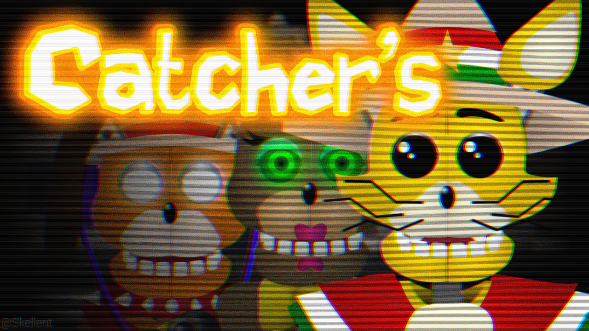

# Catcher's - La Taquería de Catcher

> Un Fangame de FNAF en Español en Scratch (PenguinMod)

Catcher's es un fangame basado en la famosa saga de Videojuegos "Five Night At Freddy's" creada por Scott Cawton; Se ambienta en Mexico en el año 2003 en un local de tacos increiblemente exitoso a tal punto de haber incorporado Animatronicos para el entretenimiento, tu labor será 
cuidar el lugar en las noches y realizar algunas tareas extra, ¡Todo lo necesario para pagar tu apartamento! 

¿Descubiras los secretos que yacen ocultos en La Taquería de Catcher?

> ¿Dónde Jugarlo? >> [Gamejolt Page](https://gamejolt.com/games/catchers/903293)

## Progreso de Personajes
| Personaje | ModeloSVG | JumpScare | Mantenimiento(Sección) | Cámaras | Modo Historia  |
| --------- | --------- | --------- | ---------------------- | ------- | -------------- |
| Catcher   | Ready     | !Ready    | !Ready                 | !Ready  | !Ready         |
| Xochi     | Ready     | !Ready    | !Ready                 | !Ready  | !Ready         |
| DJ        | Ready     | !Ready    | !Ready                 | !Ready  | !Ready         |
| Ernesto   | Ready     | !Ready    | !Ready                 | !Ready  | !Ready         |
| Pedro     | Ready     | !Ready    | !Ready                 | !Ready  | !Ready         |